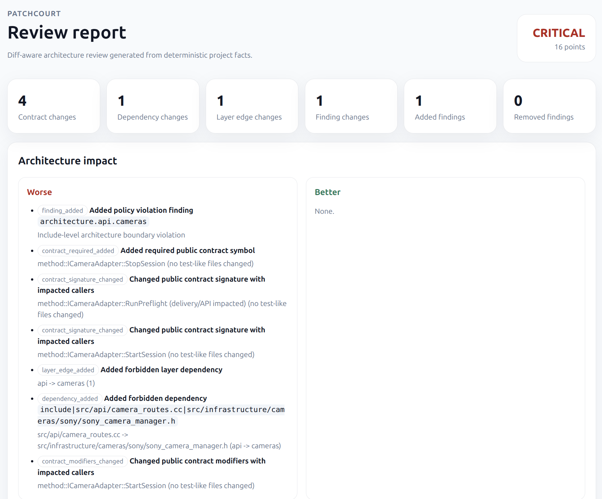
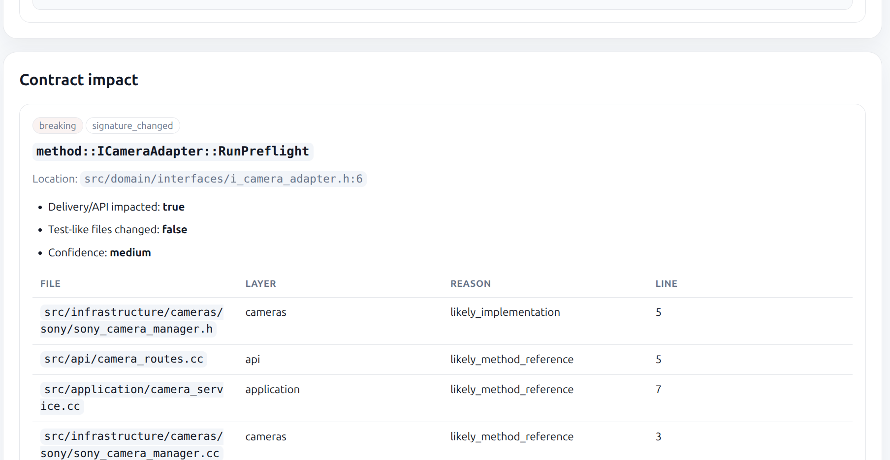
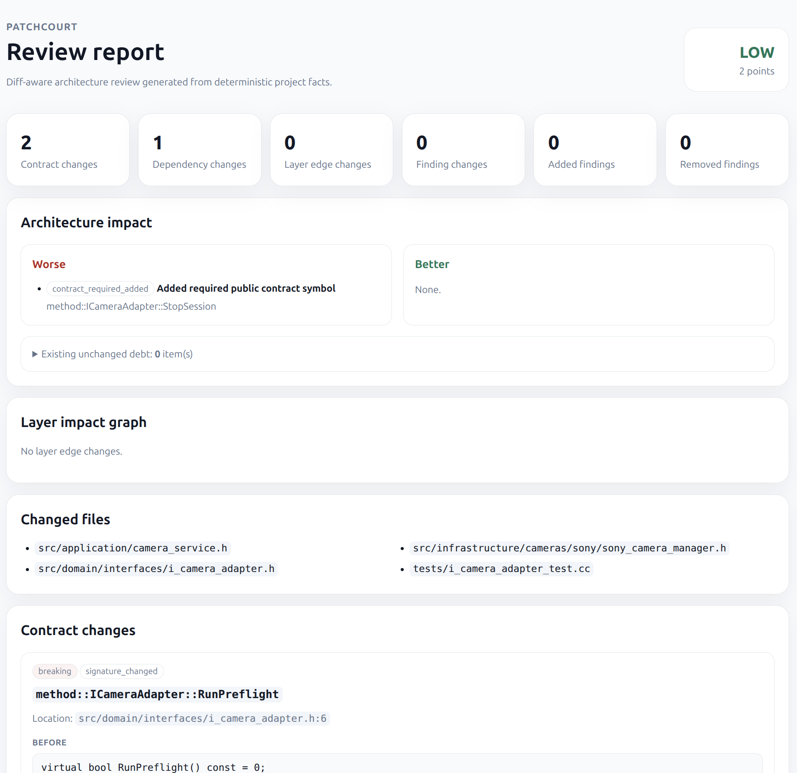

<div align="center">

# PatchCourt

### Diff-aware architecture review for C++ patches

**Did this patch make your architecture better or worse?**

PatchCourt reviews the architectural impact of C++ changes, separates **new risk** from **legacy debt**, and produces evidence down to files, include/import edges, layers, public contracts, findings, and review questions.

<br/>

[](https://go.dev/)
[](https://isocpp.org/)
[](https://sarifweb.azurewebsites.net/)
[](#v020-alpha-release-focus)

</div>

---

## Why PatchCourt exists

Large C++ systems rarely lose architecture in one dramatic commit.

They drift one patch at a time:

```text
api starts including vendor-specific implementation headers
domain pulls infrastructure details
public interfaces change without tests
old dependency cycles stay forever
reviewers cannot tell whether the patch made things worse
```

Most dependency tools show the whole existing architecture mess.

PatchCourt focuses on the patch:

```text
What got worse?
What got better?
What was already legacy debt?
Where exactly is the evidence?
What should the reviewer ask?
```

PatchCourt is not a compiler, clang-tidy replacement, generic linter, security scanner, or AI reviewer.

It is a deterministic evidence engine for architecture review.

```text
project facts
  -> dependency graph
  -> architecture rules
  -> patch diff
  -> findings
  -> review.html / review.json / review-context.md / SARIF
```

---

## Core idea

PatchCourt answers one review question:

> Did this C++ patch make the architecture better or worse?

And it answers with structured evidence:

| Signal | Example |
|---|---|
| New forbidden dependency | `api -> cameras/sony` |
| New layer edge | `domain -> infrastructure` |
| Public contract changed | `method::ICameraAdapter::RunPreflight` |
| Missing test-like changes | public interface changed, tests did not |
| Existing debt | old cycle was already present before the patch |
| Better change | forbidden dependency removed |

The important split:

```text
Worse          -> introduced by this patch
Better         -> improved by this patch
Unchanged debt -> already existed before this patch
```

That split is the product.

---

## Example: bad patch review

A bad patch might do this:

```cpp
// src/api/camera_routes.cc
#include "src/cameras/sony/sony_camera_manager.h"
```

And also change a public interface:

```cpp
// before
virtual bool RunPreflight() const = 0;

// after
virtual bool RunPreflight(int cameraIndex) const = 0;
```

PatchCourt review output is shaped like this:

```text
PatchCourt review

Risk: high, 14 points

Summary:
  contract changes:    2
  dependency changes:  4
  layer edge changes:  2
  finding changes:     3
  added findings:      3
  removed findings:    0

Architecture impact:

  Worse:
    [high] New forbidden dependency
      api -> cameras
      src/api/camera_routes.cc -> src/cameras/sony/sony_camera_manager.h

    [high] Public contract changed
      method::ICameraAdapter::RunPreflight
      before: virtual bool RunPreflight() const = 0;
      after:  virtual bool RunPreflight(int cameraIndex) const = 0;

    [medium] Public contract changed without related test-like files
      Verify callers and add or update tests.

  Better:
    none

  Unchanged debt:
    Existing unrelated architecture debt remains unchanged.
```

The key point is not that PatchCourt says “correct” or “incorrect”.

The key point is that the reviewer immediately sees **what changed architecturally**, **why it is risky**, and **where to inspect**.

---

## Example: better patch review

A better patch moves implementation details behind an interface or application boundary.

PatchCourt should become quieter:

```text
PatchCourt review

Risk: low, 2 points

Architecture impact:

  Worse:
    none

  Better:
    Removed forbidden dependency: api -> cameras/sony
    Removed direct dependency on vendor implementation
    Kept delivery code behind application/domain boundary

  Unchanged debt:
    Existing unrelated discovery hints remain unchanged.
```

This is the intended review loop:

```text
bad patch    -> reveals architecture drift
better patch -> shows the drift reduced
```

---

## Quick demo

Run the built-in camera-service demo:

```bash
git clone https://github.com/orurh/PatchCourt.git
cd PatchCourt/core/go

make camera-demo
```

Open the generated reports:

```bash
make open-camera-demo
```

## What the report looks like

<p align="center">
  
</p>

<p align="center">
  
</p>

<p align="center">
  
</p>

Generated artifacts:

```text
.patchcourt/out/examples/camera-service/bad-review.html
.patchcourt/out/examples/camera-service/bad-review.json
.patchcourt/out/examples/camera-service/bad-review.md
.patchcourt/out/examples/camera-service/bad-review.txt
.patchcourt/out/examples/camera-service/bad-context.md
.patchcourt/out/examples/camera-service/bad.sarif

.patchcourt/out/examples/camera-service/better-review.html
.patchcourt/out/examples/camera-service/better-review.json
.patchcourt/out/examples/camera-service/better-review.md
.patchcourt/out/examples/camera-service/better-review.txt
.patchcourt/out/examples/camera-service/better-context.md
.patchcourt/out/examples/camera-service/better.sarif
```

The demo compares two patches:

| Patch | Expected signal |
|---|---|
| bad patch | new architecture drift and higher review risk |
| better patch | less drift and lower review risk |

---

## What PatchCourt generates

| Artifact | Purpose |
|---|---|
| `review.html` | Static human-readable architecture review |
| `review.json` | Machine-readable PatchCourt review result |
| `review.md` | Markdown review output |
| `review.txt` | Terminal-friendly output |
| `review-context.md` | LLM-ready context pack |
| `patchcourt.sarif` | CI/code scanning integration export |

SARIF is an integration layer.

The primary PatchCourt artifacts are:

```text
review.html
review.json
review-context.md
```

---

## Main workflow

Build PatchCourt:

```bash
cd core/go
go build -o ./bin/patchcourt ./cmd/patchcourt
```

Review a branch against `origin/main`:

```bash
./bin/patchcourt review \
  --base origin/main \
  --head HEAD \
  --format json \
  --html-out .patchcourt/out/review.html \
  --llm-pack \
  --llm-pack-out .patchcourt/out/review-context.md \
  --sarif-out .patchcourt/out/patchcourt.sarif \
  > .patchcourt/out/review.json
```

Review the current working tree:

```bash
./bin/patchcourt review \
  --base main \
  --worktree \
  --format json \
  --html-out .patchcourt/out/review.html \
  --llm-pack \
  --llm-pack-out .patchcourt/out/review-context.md \
  --sarif-out .patchcourt/out/patchcourt.sarif \
  > .patchcourt/out/review.json
```

Review two directories:

```bash
./bin/patchcourt review \
  --before-root /tmp/before \
  --after-root /tmp/after \
  --format markdown
```

---

## HTML report

`review.html` is the main human-facing artifact.

It is designed for code review and CI artifacts:

```text
Verdict / risk
Risk reasons
Worse / Better / Unchanged debt
Changed files
Layer impact graph
Contract changes
Contract impact
Finding changes
Dependency changes
Review questions
```

No external service is required to open the report.

---

## LLM context pack

PatchCourt can generate a deterministic context pack for LLM-assisted review:

```bash
./bin/patchcourt review \
  --base origin/main \
  --head HEAD \
  --llm-pack \
  --llm-pack-out .patchcourt/out/review-context.md
```

The pack contains:

```text
patch summary
raw changed files
analyzed changed files
touched layers
architecture impact
contract changes
dependency changes
finding changes
risk reasons
review questions
```

Principle:

```text
LLM may summarize and ask review questions.
LLM must not invent files, symbols, dependencies, or findings.
```

PatchCourt collects the facts first.

The LLM works on top of the evidence.

---

## SARIF and CI

PatchCourt can export SARIF for code scanning integrations:

```bash
./bin/patchcourt review \
  --base origin/main \
  --head HEAD \
  --sarif-out .patchcourt/out/patchcourt.sarif
```

GitHub Actions example:

```yaml
name: PatchCourt

on:
  pull_request:
  push:
    branches: [main]

permissions:
  contents: read
  security-events: write

jobs:
  patchcourt:
    runs-on: ubuntu-latest

    steps:
      - uses: actions/checkout@v4
        with:
          fetch-depth: 0

      - name: Install PatchCourt
        run: |
          curl -L -o patchcourt.tar.gz \
            https://github.com/orurh/PatchCourt/releases/download/v0.2.0-alpha/patchcourt-linux-amd64.tar.gz
          tar -xzf patchcourt.tar.gz
          sudo mv patchcourt /usr/local/bin/patchcourt

      - name: Run PatchCourt review
        run: |
          mkdir -p .patchcourt/out
          patchcourt review \
            --base origin/main \
            --head HEAD \
            --format json \
            --html-out .patchcourt/out/review.html \
            --llm-pack \
            --llm-pack-out .patchcourt/out/review-context.md \
            --sarif-out .patchcourt/out/patchcourt.sarif \
            > .patchcourt/out/review.json

      - name: Upload SARIF
        uses: github/codeql-action/upload-sarif@v3
        with:
          sarif_file: .patchcourt/out/patchcourt.sarif

      - name: Upload PatchCourt artifacts
        uses: actions/upload-artifact@v4
        with:
          name: patchcourt-report
          path: .patchcourt/out
```

More CI examples:

```text
core/go/docs/ci/github-actions.md
core/go/docs/ci/gitlab-ci.md
```

Recommended alpha behavior:

```text
generate review.html
upload review artifacts
upload SARIF where supported
do not fail CI by default
```

Blocking mode should be explicit and project-owned.

---

## Project check mode

PatchCourt can inspect current project architecture:

```bash
./bin/patchcourt check /path/to/project
```

Typical artifacts:

```text
.patchcourt/out/project-model.json
.patchcourt/out/scan.md
.patchcourt/out/layer-graph.json
.patchcourt/out/layer-graph.dot
.patchcourt/out/layer-graph.mmd
.patchcourt/out/report.html
```

Use this for:

```text
understanding project structure
finding suspicious layer edges
generating dependency graphs
building an initial baseline config
```

---

## Edge drill-down

Explain a concrete layer dependency:

```bash
./bin/patchcourt edge \
  --model .patchcourt/out/project-model.json \
  api cameras
```

Example output:

```text
PatchCourt edge

Edge: api -> cameras
Count: 3

Usage:
  used:    3
  maybe:   0
  unused:  0
  unknown: 0

Top source files:
  3  src/api/camera_routes.cc

Top target files:
  1  src/cameras/sony/sony_camera_manager.h

Dependencies:
  src/api/camera_routes.cc
    -> src/cameras/sony/sony_camera_manager.h [used]
```

Graphs are useful.

Evidence is better.

---

## Configuration

PatchCourt uses `.patchcourt.yaml` to describe architecture boundaries.

Example:

```yaml
ignore:
  paths:
    - build/**
    - cmake-build-*/**
    - third_party/**
    - external/**
    - generated/**
    - "**/*.pb.cc"
    - "**/*.pb.h"

cpp:
  compile_commands:
    auto_discover: true
  include_paths:
    - src
    - include

layers:
  api:
    paths:
      - src/api/**
      - src/server/**
    may_depend_on:
      - controllers
      - domain

  controllers:
    paths:
      - src/controllers/**
    may_depend_on:
      - domain
      - cameras

  domain:
    paths:
      - src/domain/**
    may_depend_on: []

  cameras:
    paths:
      - src/cameras/**
    may_depend_on:
      - domain

forbidden_imports:
  - from_layer: api
    patterns:
      - src/cameras/sony/**
      - src/cameras/*_impl/**
```

Generate an initial config:

```bash
./bin/patchcourt init /path/to/project > .patchcourt.yaml
```

Baseline mode is useful for legacy projects: accept current dependencies, prevent new drift.

Strict mode is useful for greenfield or cleanup work: report existing violations immediately.

---

## What works today

| Area | Status |
|---|---|
| C++ file indexing | works |
| C++ include graph | works |
| `compile_commands.json` discovery | works |
| configured include paths | works |
| Go import baseline | works |
| layer rules via `.patchcourt.yaml` | works |
| architecture findings | works |
| edge drill-down | works |
| before/after review | works |
| git base/head review | works |
| worktree review | works |
| public contract diff | alpha |
| test-like review questions | alpha |
| `review.html` | alpha |
| LLM context pack | alpha |
| SARIF export | alpha |

---

## What PatchCourt is not

PatchCourt is not:

```text
a C++ compiler frontend
a clang-tidy replacement
a proof of correctness
a generic security scanner
a Go linter replacement
a full AI code reviewer
a web app
```

PatchCourt is:

```text
a deterministic architecture-impact reviewer for patches
```

---

## Current limitations

PatchCourt is alpha-stage software.

Current limitations:

- C++ analysis is lightweight and does not use Clang AST yet.
- Include resolution quality depends on `compile_commands.json` or `.patchcourt.yaml`.
- CMake lightweight extraction is not a full CMake evaluator.
- Public contract extraction is heuristic.
- Risk score is review prioritization, not a correctness verdict.
- SARIF is an export/integration layer, not the core PatchCourt model.
- Go support is baseline-level and not the main product focus.
- False positives are possible and should be reviewed with the provided evidence.

---

## v0.2.0-alpha release focus

The `v0.2.0-alpha` release focuses on:

```text
diff-aware C++ architecture review
review.html
review.json
review-context.md
patchcourt.sarif
camera-service bad/better demo
GitHub Actions / GitLab CI examples
release gates via make release-check
```

Not included in this release:

```text
Clang backend
VS Code extension
web server
GitHub PR bot
GitLab native SAST JSON
deep cache
suppressions UI
broad Go/C++ risk-rule expansion
```

---

## Development

From `core/go`:

```bash
make help
make ci
make camera-demo
make self-review BASE=HEAD
make release-check BASE=HEAD
```

Architecture guardrails are enforced by tests.

Core/usecase/analyzer packages return structured results and must not write directly to stdout/stderr.

---

## License

TBD.
